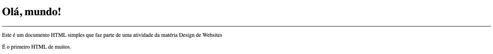
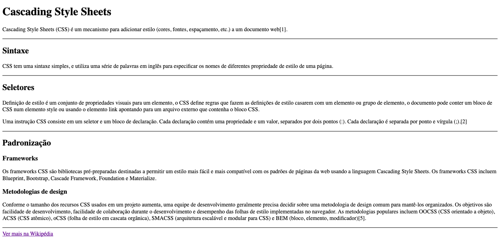
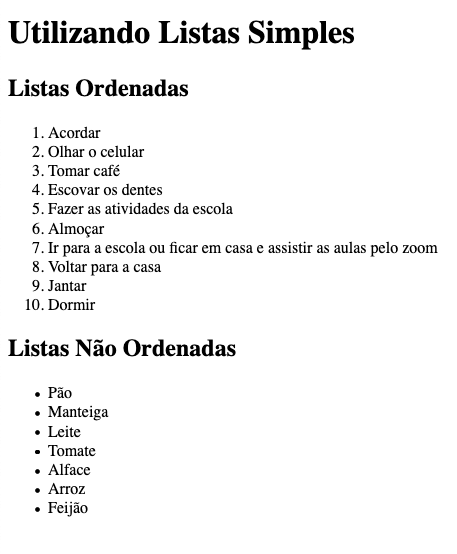

# Atividade 1 - Tags Básicas HTML5

Esta é uma atividade composta de 4 exercícios.
 
 
Cada exercício deve ser realizado em um documento HTML5 diferente.
 
 
Todas as imagens abaixo podem ser expandidas para melhor visualização através de um clique.
 
 

  1. Utilizando os conhecimentos adquiridos em aula, construa um documento HTML5 conforme a imagem abaixo.

  

 
 

  2. Através de uma pesquisa de imagens no Google, construa a página HTML5 abaixo. Não se preocupe com as dimensões da imagem.

  

 
 

  3. Utilizando o que aprendemos sobre hierarquia de títulos e através de uma consulta a Wikipédia sobre as CSS, construa a página HTML5 abaixo. Não se esqueça de adicionar um link para uma pesquisa mais completa. Link para consulta: https://pt.wikipedia.org/wiki/Cascading_Style_Sheets.

  

 
 

  4. Utilizando seu conhecimento sobre listas, construa um documento HTML conforme a imagem abaixo:

  

